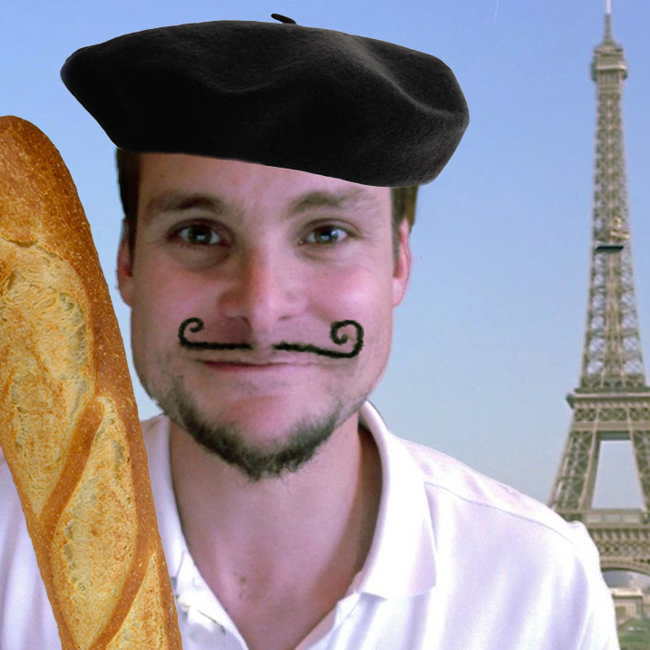

# frenchizer

## A utility function to translate english into "french"



This neat utility will enable to change your English sentence into French so that every person in Paris will understand what you mean.

For example,
```
// This is the castle of our master, Guy de Loimbard!
```
becomes

```
Uh zis is ze castle of ouR masteR, Guy de LoimbaRd sacrebleu!
```

or 
```
// I don't think he will be very keen you see, because he already got one
```
becomes
``` 
// Uh I don't zink he will be veRy keen you see, because he alReady got one sacrebleu
```

This author will not be liable for any taunt due to the French characters.

